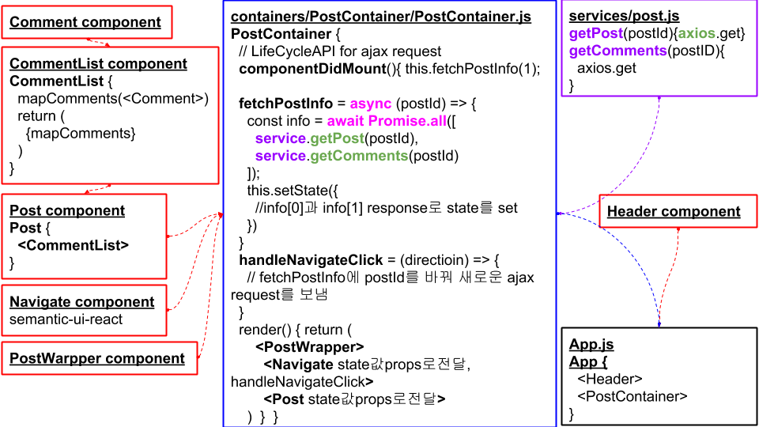

# React ajax tutorial
Simple react ajax request via axios, without redux. Virtual server(JSONPlaceholder) used. SNS kind of page construct via react. Animation(Warning, Translate) applied version. Check it via [githubPages](https://ginnyang2.github.io/react-ajax-tutorial/)

## Components structure

  

## Apply Warning Animation
When it fails to post request, Warning Animation appears to know user that request is failed. There are two ways to adapt animation. The one is using SetInterval, the other is using SetTimeout. I chose the previous one, blogger who wrote reference chose the latter. Compare two structures below.

### Using SetInterval

  

### Using SetTimeout

  

## Apply Translate Animation

### Apply CSS via ClassName change
- When navi button clicked
   1. Current Post Out Ani
   2. Next Post In Ani

- 다음 세 가지 react와 javascript 특성으로 두 개의 애니메이션 순차적 실행
   1. setState({})하면 render() 실행
   2. render()하면 LifeCycleAPI 실행
   3. setTimeout()은 aync로 동작

- className을 상황에 따라 변경시켜서 CSS에 정의해놓은 4가지의 animation이 동작되게 함
   1. animation-name + animation-duration + @keyframes %별 정의
   2. animation-name + animation-duration + @keyframes from/to 정의

  

- comment on this work
   1. setInterval로 애니메이션 구현할 때 setState 작동이 남발되서 필요없는 렌더링이 timeInterval만큼 일어남. 그러므로 className을 적용해서 css @keyframes를 정의해서 애니메이션 구현하는 것을 추천한다.
   2. 경계조건에 신경쓰자. 많은 에러들이 경계조건을 바로 잡는 것으로부터 해결된다.
   3. LifeCycleAPI에 대한 충분한 이해가 없을 때는 console로 API들의 작동순서를 직접 보며 필요한 일을 처리하자.
   
- small splint 작업 순서 및 작업 시간 정립(1 small sprint / 3 days)
   1. 가능한 자세한 기능 논술. 가능한 잘게 쪼개기. 코드에 대한 내용도 들어가면 좋다(Trello 'CareerPrep' Board의 'Ajax in React' card의 Comment(Nov 26 at 4:02 PM)참조. 작업 시간 1일.
   2. 기능 논술을 바탕으로 직접 코딩작업. 논술 순서대로 하나씩 작업해 나가기. 작업 시간 1일
   3. googlePT로 구조도 만들고 github README.md에 설명과 함께 업데이트. 작업 시간 1일
   4. 1~3단계에서 팀 작업일시 팀 리뷰 추가.

## Reference
- React tutorial - Velopert Blog [컴포넌트 구성 & AJAX & 애니메이션](https://velopert.com/2597)
- JSONPlaceholder - [Fake online REST API for Testing and Prototyping](https://jsonplaceholder.typicode.com/)
- [CSS Animations - W3SCHOOLS](https://www.w3schools.com/css/css3_animations.asp)
- [CSS 2D Transform - W3SHOOLS](https://www.w3schools.com/css/css3_2dtransforms.asp)
